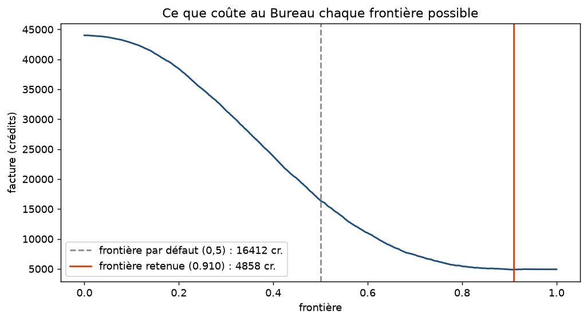

# Rapport au Conseil — réception des relevés Klaxo-3

## Phase 1 — Ouvrir la caisse

- Lignes dans le fichier : 88 875
- Lignes chargées : 88 679
- Lignes traitées à part : 196

Le fichier arrive sans en-têtes, je les remets depuis le manifeste. J'évite les options de
`read_csv` qui réparent les lignes cassées : elles les suppriment sans prévenir. Je lis ligne
par ligne et j'écarte tout ce qui n'a pas exactement 11 champs. Les sauts de ligne du fichier
brut sont 88 875 eux aussi, donc rien n'a été fusionné en route.

Les 196 écartées ont toutes 12 champs. Le script en affiche une (ligne 877) : tout est décalé
d'un cran à partir du commentaire. Seules 22 ont une reconstruction unique, 84 en ont deux
possibles et 90 aucune — les recoller serait inventer des valeurs. 0,22 % du fichier.

## Phase 2 — Rien n'est du bon type

Je convertis sans rien supprimer : ce qui ne passe pas devient `null` et je le compte.
88 679 lignes en entrée comme en sortie.

| Champ | Type visé | Vides | Ont résisté | Valeurs fautives |
|---|---|---|---|---|
| `duration_seconds` | nombre | 2 | 4 | 2, 8 et 0.5 suivis d'une apostrophe inversée, `2631600` entouré d'espaces |
| `latitude` | nombre | 0 | 1 | `33q.200088` |
| `longitude` | nombre | 0 | 0 | — |
| `datetime` | date + heure | 0 | 1220 | `1/1/1910 24:00` |
| `date_posted` | date | 0 | 0 | — |

Les six autres champs sont du texte et le restent.

Les 1 220 heures `24:00` se récupèrent sans rien inventer : minuit de fin de journée, c'est
00:00 du lendemain. Je bascule une fois le comptage fait, donc le tableau garde le chiffre
brut et la colonne finit complète. Pas question de faire pareil avec `33q.200088` : deviner
ce que cachait le `q` serait inventer une coordonnée, je la laisse vide.

| Anomalie | Compte | D'où ça vient |
|---|---|---|
| lettre au milieu d'une coordonnée | 1 | transmission |
| apostrophe inversée collée à la durée | 3 | témoin |
| espaces autour de la durée | 1 | transmission |
| heure `24:00`, qui n'existe pas | 1220 | capteur |
| entités HTML dans le témoignage (`&#44`) | 35 417 | transmission |
| pays non renseigné | 12 365 | témoin |
| coordonnées à (0, 0) | 1 494 | capteur |

Pour l'origine, je regarde qui écrit quoi : une coordonnée est calculée et pas tapée, donc
une lettre au milieu vient du transport ; l'apostrophe collée à un chiffre est une faute de
frappe ; le `24:00`, qui revient 1 220 fois, est une convention du système qui horodate ; les
`&#44` sont un encodage ajouté pour que les virgules des témoignages ne cassent pas le CSV.

Les deux dernières ne font planter aucune conversion, et c'est ce qui les rend gênantes. Les
1 494 coordonnées à (0, 0) sont des villes comme `turin (italy)` que le géocodage n'a pas su
placer : zéro est un nombre valide, donc rien ne proteste, mais le point atterrit au large de
l'Afrique.

Une seule valeur, `33q.200088`, suffirait à faire basculer toute la colonne `latitude` en
texte si on laissait la bibliothèque deviner. Types corrigés, la carte se trace :


On reconnaît les États-Unis, l'Europe, le Japon et l'Australie. Le point isolé au large de
l'Afrique, ce sont les 1 494 coordonnées à (0, 0).

## Phase 3 — Trier les canulars

**La règle :** un relevé est un canular si le Bureau a écrit dans sa note qu'il s'agit d'un
canular, ou d'un rapport d'élève qu'il ne peut pas certifier.

- Marqués canulars : **871** sur 88 679, soit **0,98 %** — 781 notés « hoax », 90 notés
  « student report » seulement

Le Bureau annote les dossiers douteux entre doubles parenthèses : `((HOAX??))` devant le
témoignage, ou `((NUFORC Note: Student report. PD))` à la fin. Je ne retiens que ce qui est
écrit dans ces notes — 21 autres relevés contiennent le mot « hoax », mais c'est le témoin
qui l'écrit, souvent pour jurer que son observation n'en est pas un.

Le Bureau annote surtout des méprises : Vénus, Sirius, une traînée d'avion, un lancement de
missile, 1 478 relevés en tout. Je ne les compte pas — le témoin a bien vu quelque chose, il
l'a mal identifié, ce n'est pas un mensonge.

Ce que la règle rate : tous les canulars que le Bureau n'a jamais annotés. Elle ne mesure
pas les canulars, elle mesure le travail d'annotation du Bureau. 0,98 % est donc un
plancher, sûrement très en dessous du vrai chiffre.

Ce qu'elle attrape à tort : 622 des 871 notes disent « hoax?? », avec deux points
d'interrogation. C'est un soupçon, pas un verdict, et je les compte quand même comme
canulars.

## Phase 4 — Le premier verdict

- Sur 100 canulars réellement présents, le système en attrape : **100**
- Sur 100 relevés signalés, sont vraiment des canulars : **92**

Ces deux nombres sont calculés sur un quart des relevés, soit **22 170 lignes dont 218
canulars**, mises de côté avant l'entraînement et jamais vues par le modèle. Le tirage est
stratifié, pour garder la même proportion des deux côtés, et la graine est fixée à 0.

Le modèle est une régression logistique. Il reçoit le témoignage découpé en mots, la forme et
le pays, la durée, les coordonnées, et le délai entre l'observation et sa publication.

Un réglage avant de commencer : la régularisation. Le vocabulaire fait près de 13 000 colonnes
pour 650 canulars à l'entraînement, donc le modèle a toute la place d'apprendre par cœur. Je
découpe une validation **dans la partie apprentissage** — 49 881 relevés pour apprendre,
16 628 pour juger :

| C | 0,003 | 0,01 | **0,03** | 0,1 | 0,3 | 1 |
|---|---|---|---|---|---|---|
| AUC sur la validation | 0,705 | 0,726 | **0,736** | 0,731 | 0,717 | 0,698 |

Je retiens 0,03. La valeur par défaut des bibliothèques est 1, et c'est la pire des six : le
modèle qu'on obtient sans rien régler est un modèle qui récite. Le test n'entre pas dans ce
choix, et je ne retouche plus ce réglage ensuite.

Attraper 100 canulars sur 100, ça ne ressemble pas à un vrai résultat. Je regarde d'où ça
vient à la phase suivante.

## Phase 5 — Le Conseil ne vous croit pas

| Ce que le modèle lit | Qui écrit l'information | À quel moment | Savait-elle déjà s'il s'agissait d'un canular ? |
|---|---|---|---|
| `comments` : le témoignage | le témoin | au signalement | non |
| `comments` : la note `((...))` | le Bureau | au traitement, des semaines après | **oui** |
| `shape` | le témoin | au signalement | non |
| `country` | le témoin | au signalement | non |
| `state` | le témoin | au signalement | non |
| `duration_seconds` | le témoin | au signalement | non |
| `datetime` : heure, mois, année | le témoin | au signalement | non |
| longueur et exclamations du récit | le témoin | au signalement | non |
| `latitude` | le géocodage automatique | au traitement | non |
| `longitude` | le géocodage automatique | au traitement | non |
| `delai_jours` (`date_posted` − `datetime`) | le Bureau | à la publication | **oui** |

`comments` compte pour deux lignes parce que deux personnes y écrivent, à deux moments. Je
retire la note du Bureau et le délai de publication, je garde le récit du témoin.

|  | Avant | Après |
|---|---|---|
| Sur 100 canulars, attrapés | 100 | 58 |
| Sur 100 signalés, justes | 92 | 3 |
| Relevés dénoncés sur 22 170 | 235 | 4 997 |
| AUC (0,5 = tirage au sort) | 1,000 | 0,765 |

Le premier chiffre n'avait pas le droit d'exister parce que la réponse à deviner était écrite
dans le texte que je donnais à lire : le mot « hoax » de la note servait à la fois à fabriquer
l'étiquette et à la retrouver. Le modèle ne prédisait rien, il recopiait une conclusion qu'un
employé du Bureau avait tirée des semaines plus tôt. Devant un signalement qui vient
d'arriver, cette note n'existe pas — il ne reste que le récit du témoin, et y repérer un
mensonge est autrement plus difficile. La troisième ligne le dit : pour attraper ses
canulars, le modèle honnête en dénonce 4 997 là où le premier en dénonçait 235.

J'ai vérifié que le nettoyage tenait : plus aucun relevé étiqueté canular ne contient de
marqueur, et les mots les plus révélateurs sont devenus du vocabulaire banal (`alleged`,
`claim`, `wonderful`). J'ai aussi dû jeter une variable que j'avais ajoutée, la proportion de
majuscules : elle valait 2,1 fois plus chez les canulars, parce que `((HOAX??))` est en
capitales. C'était la note du Bureau qui rentrait, déguisée en statistique.

Reste à savoir si ce plancher vient de l'information manquante ou de mon choix de modèle. Un
gradient boosting, avec le témoignage résumé en 120 dimensions, attrape **51 canulars sur 100
avec 5 justes sur 100**, AUC 0,827 : un peu moins que ma régression, mais en dénonçant deux
fois moins de monde (2 409 contre 4 997). Une partie du plancher venait donc du modèle, et
l'écart avec la phase 4 ne se referme pas pour autant.

## Phase 6 — Le modèle le plus bête du Bureau

Son système tient en une ligne : répondre « ce n'est pas un canular », toujours.

|  | Bonnes réponses | Canulars attrapés | Dossiers à relire |
|---|---|---|---|
| Le stagiaire | **99,02 %** | 0 sur 218 | 0 |
| Mon modèle (régression logistique) | 77,61 % | 126 sur 218 | 4 997 |
| Mon meilleur modèle (gradient boosting) | 89,16 % | 112 sur 218 | 2 409 |

Le classement s'inverse d'une colonne à l'autre : plus un système attrape de canulars, plus
son taux de bonnes réponses baisse. C'est déjà tout le problème.

**La mesure que je présente au Conseil : le nombre de canulars attrapés, mis en face du
nombre de dossiers à relire.** Le stagiaire en retrouve zéro, son système ne fait gagner une
minute à personne. Le mien en retrouve 126 sur 218 en faisant relire 4 997 dossiers au lieu de
22 170, soit 78 % de travail en moins ; le boosting en retrouve 112 pour 2 409 dossiers.

Pourquoi son 99 % ne prouve rien : ce score ne mesure pas sa capacité à trier, il mesure la
rareté des canulars. Comme ils ne sont que 0,98 % du fichier, répondre non à tout suffit.
Appliqué à un fichier où un relevé sur deux serait un canular, le même système tomberait à
50 % — son score dépend du fichier qu'on lui donne, pas de ce qu'il fait.

Je ne pouvais d'ailleurs pas le battre sur cette mesure, pour une raison arithmétique : il se
trompe 218 fois et n'accuse personne à tort, donc il me faudrait accuser à tort moins souvent
qu'à raison, soit une précision au-dessus de 50 %. J'en suis à 3.

## Phase 7 — Plusieurs témoins, un seul événement

Deux relevés parlent du même événement s'ils partagent **la ville, l'état et le jour de
l'observation**, ou si **leur témoignage est recopié mot pour mot**.

- Événements signalés par plus d'un témoin : **2 418** (5 468 relevés concernés)
- Témoins du plus gros : **56**
- Relevés à cheval sur les deux côtés dans la découpe d'hier : **2 397**

Le plus gros rassemblement est Tinley Park (Illinois), le 31 octobre 2004 — celui-là même que
le conseiller à la cartographie cite. Le script l'affiche en entier, ses 56 témoins tous du
même côté de la nouvelle découpe.

Les recopies mot pour mot font 612 relevés pour 251 textes distincts, mais je ne les regroupe
pas toutes : « Fireball » écrit par douze personnes dans douze villes n'est pas un événement,
c'est un mot courant. Je ne retiens que les textes de plus de 80 caractères, soit 56 relevés,
où la recopie ne peut pas être un hasard. Le Bureau le confirme sur l'un d'eux : « One of four
reports from same source ».

|  | Avant | Après |
|---|---|---|
| Sur 100 canulars, attrapés | 58 | 61 |
| Sur 100 signalés, justes | 3 | 3 |
| AUC | 0,765 | 0,773 |

Les deux nombres bougent peu, et dans le bon sens : 2 397 relevés étaient mal placés, mais
cela reste 2,7 % du fichier. La fuite était réelle, son effet est petit — ça ne rend pas la
correction facultative, ça montre qu'elle aurait davantage compté sur un modèle qui
s'appuyait plus sur le texte.

## Phase 8 — L'ordre des choses

Je coupe sur **`date_posted`**, la date à laquelle le Bureau a reçu le dossier, et non sur
celle de l'observation : c'est dans cet ordre qu'il les annote, et comme mon étiquette vient
de ses notes, couper sur la date d'observation laisserait le modèle apprendre d'annotations
écrites après celles du test. Je coupe aussi par événement, pour ne pas défaire la phase 7.

- Date de coupure : **10 octobre 2011**

|  | Apprentissage | Test |
|---|---|---|
| Relevés | 66 509 | 22 170 |
| Canulars | 707 | 164 |
| Proportion de canulars | **1,06 %** | **0,74 %** |

|  | Avant | Après |
|---|---|---|
| Sur 100 canulars, attrapés | 61 | 63 |
| Sur 100 signalés, justes | 3 | 1 |
| AUC | 0,773 | **0,681** |

Les deux proportions ne sont pas égales, et l'année par année dit pourquoi : les canulars
n'ont pas diminué, c'est le Bureau qui a changé de pratique. Avant 2004 il n'annotait presque
rien — zéro canular sur 982 relevés en 1998 — les notes apparaissent en 2004, culminent à
2,85 % en 2008, puis retombent à 0,48 % en 2012.

Mon étiquette ne mesure donc pas la fréquence des canulars mais le rythme de travail des
annotateurs. D'où la chute de 0,773 à 0,681 : le modèle a appris pendant les années fastes de
l'annotation, et on le note sur une période où le Bureau annotait deux fois moins.

## Phase 9 — Les cases vides

Les trois colonnes les plus trouées, et la proportion de canulars de chaque côté :

| Colonne | Cases vides | Canulars si la case est vide | Canulars si elle est remplie |
|---|---|---|---|
| `country` | 12 365 | **1,21 %** | 0,95 % |
| `state` | 7 409 | **1,35 %** | 0,95 % |
| `duration_hours_min` | 3 017 | **2,42 %** | 0,93 % |

Un trou n'est pas neutre : dans les trois cas, un relevé incomplet est plus souvent un
canular. L'écart est net sur la durée écrite à la main, deux fois et demie plus. Ça se
comprend — quelqu'un qui invente une observation ne remplit pas les cases facultatives.

Jeter ces lignes aurait supprimé 12 365 relevés dont la vacuité était justement un indice ;
les remplir avec la valeur la plus fréquente aurait fait passer un dossier bâclé pour un
dossier ordinaire.

**Le traitement retenu :** je garde le vide comme une catégorie à part entière, et j'ajoute
pour chacune des trois colonnes une variable qui vaut 1 quand la case était vide. Le modèle
continue donc de savoir qu'il y avait un trou, même après que le trou a été bouché.

|  | Avant | Après |
|---|---|---|
| Sur 100 canulars, attrapés | 63 | 63 |
| Sur 100 signalés, justes | 1 | 1 |
| AUC | 0,681 | 0,686 |

## Phase 10 — La chaîne de traitement du Bureau

|  | Apprentissage | Test |
|---|---|---|
| Relevés | 66 509 | 22 170 |
| Proportion de canulars | 1,06 % | 0,74 % |

Le test contient 164 canulars — pas énorme, mais assez pour que mes deux nombres veuillent
dire quelque chose : le risque d'une partie test presque vide, que le Conseil signale, ne se
réalise pas ici.

Tout ce qui s'apprend depuis les données vit maintenant dans une classe `Chaine` : le
vocabulaire, les catégories, les médianes qui bouchent les trous, les échelles. Sa méthode
`apprendre` n'est appelée qu'après la découpe et ne reçoit que la partie apprentissage — elle
n'a matériellement pas accès au test. Et un relevé neuf traverse tout d'un seul appel : le
script en fait passer un, inventé à la main, onze champs bruts en entrée et un verdict en
sortie.

|  | Avant | Après |
|---|---|---|
| Sur 100 canulars, attrapés | 63 | 63 |
| Sur 100 signalés, justes | 1 | 1 |
| AUC | 0,686 | 0,686 |

Les chiffres ne bougent pas, et je préfère le dire : je calculais déjà mes médianes et mon
vocabulaire sur la seule partie apprentissage, donc la faute que le Conseil cherchait n'était
pas commise. Ce qui change n'est pas le résultat mais la garantie — avant il fallait me croire
sur parole, maintenant c'est la structure qui l'impose.

## Phase 11 — Combien de temps ça a duré

Le service de transmission a fabriqué la colonne en secondes à partir de ce que le témoin
avait écrit, et il l'a parfois ratée. Je relis donc le texte d'origine — « 5 minutes »,
« 1-2 hrs », « one minute » — et je m'en sers quand la colonne propre annonce 0 ou rien.

- Durées reste inutilisables après traitement : **7 006** (7 033 avant récupération)
- Relevés où les deux colonnes se contredisent : **1 508**
- Durée médiane : **180 secondes**, soit trois minutes
- Relevés annonçant plus d'une journée : **205**

Deux natures d'aberration :

| Aberration | Compte | D'où ça vient |
|---|---|---|
| durée perdue : 0 en secondes alors que le témoin avait écrit une durée lisible | 27 | transmission |
| durée physiquement invraisemblable, plus d'une journée | 205 | témoin |

Les 7 006 qui restent inutilisables ne sont pas un échec de lecture : ce sont des cases vides
(3 017) ou des réponses qu'aucun traitement ne peut chiffrer — « unknown » (528), « seconds »
(525), « ? » (177), « few seconds » (168). Je ne leur invente pas de valeur : « seconds » sans
nombre devant, ce n'est pas une durée.

Les trois durées les plus longues :

```
97 836 000 s (1 132 jours)  écrit : « 31 years »
82 800 000 s (  958 jours)  écrit : « 23000hrs »
66 276 000 s (  767 jours)  écrit : « 21 years »
```

Je les garde : ce sont des relevés valides par ailleurs, et les supprimer changerait le nombre
de lignes, ce que l'étape m'interdit. Je marque l'invraisemblance dans une colonne à part, et
le modèle lit le logarithme de la durée, ce qui rend ces extrêmes inoffensifs. C'est aussi
pourquoi je donne la médiane et pas la moyenne — trois relevés à trente ans déplaceraient une
moyenne, ils ne déplacent pas la médiane d'une seconde.

Un relevé où les deux colonnes racontent deux histoires différentes :

```
duration_seconds   : 2102400
duration_hours_min : « >8 months » → 20736000 s
témoignage         : Collection of orbs, rods and discs sighted in Virginia.
```

88 679 lignes en entrée, 88 679 en sortie.

## Phase 12 — La ville et l'heure

- Villes distinctes : **22 018**
- Villes qui n'apparaissent **qu'une seule fois** : **14 177**, soit près des deux tiers

**La règle :** je garde les villes vues au moins 20 fois dans la partie apprentissage, et je
verse toutes les autres dans un même sac « ville rare ».

| Tableau donné au modèle | Colonnes |
|---|---|
| sans la ville | 13 158 |
| avec une colonne par ville | **32 112** |
| avec la règle | **13 660** (dont 502 de ville) |

Une colonne par ville aurait ajouté 19 000 colonnes dont la plupart n'auraient contenu qu'un
seul 1 — le modèle aurait appris par cœur des villes qu'il ne reverra jamais.

L'heure, je la pose sur un cercle : un sinus et un cosinus, au lieu d'un entier de 0 à 23.

| Distance | Dans mon encodage |
|---|---|
| entre 23 h et 0 h | **0,261** |
| entre 23 h et 20 h | **0,765** |

23 h est donc trois fois plus proche de minuit que de 20 h, ce qui correspond au ciel. Sur
une règle graduée, la première distance valait 23 et la seconde 3.

Pour `shape`, j'ai fondu `changed` dans `changing` et `round` dans `circle`. Je compte **30
catégories au départ** : les 29 formes que le Conseil annonce, plus la case vide de 2 922
relevés, que je garde comme une catégorie à part (phase 9). Il reste donc **28 formes**, et
les plus rares — `delta`, `crescent`, `pyramid`, `hexagon`, `dome` — rejoignent le sac des
villes rares.

|  | Avant | Après |
|---|---|---|
| Sur 100 canulars, attrapés | 63 | 62 |
| Sur 100 signalés, justes | 1 | 1 |
| AUC | 0,686 | 0,680 |

Le résultat baisse, et je ne vais pas prétendre le contraire. La ville n'apporte rien parce
que le modèle a déjà la latitude et la longitude, qui portent la même information en deux
colonnes au lieu de cinq cents ; des seuils plus sévères (50, 100, 200) ne font pas mieux.
L'heure circulaire ne change presque rien à l'AUC, mais elle corrige une absurdité — mon
modèle croyait minuit à vingt-trois heures de distance de 23 h. Je préfère un chiffre honnête
sur un encodage juste qu'un chiffre flatteur sur un encodage faux.

Aucun de ces encodages ne se sert de la cible : ce sont des comptages de fréquence, appris sur
la partie apprentissage seule.

## Phase 13 — La facture du Bureau

Mon système ne rend pas un verdict, il rend un nombre entre 0 et 1. La frontière entre ce
nombre et le mot « canular », je ne l'avais jamais posée : la bibliothèque le faisait à ma
place, à 0,5, parce que c'est le milieu.

Un canular manqué coûte 30 crédits, une fausse alerte 2. Dénoncer un relevé de plus rapporte
donc s'il a plus de **6,25 %** de chances d'être un canular — 2 sur 32 — et coûte en dessous.

| Frontière | Dénoncés | Attrapés | Ratés | Fausses alertes | Facture |
|---|---|---|---|---|---|
| 0,100 | 21 519 | 163 | 1 | 21 356 | 42 742 |
| 0,300 | 15 478 | 138 | 26 | 15 340 | 31 460 |
| **0,500** | 7 362 | 101 | 63 | 7 261 | **16 412** |
| 0,700 | 1 954 | 46 | 118 | 1 908 | 7 356 |
| 0,900 | 69 | 5 | 159 | 64 | 4 898 |
| **0,910** | 49 | 5 | 159 | 44 | **4 858** |
| ne rien dénoncer | 0 | 0 | 164 | 0 | 4 920 |



- Frontière retenue : **0,910**
- Facture à 0,5 : **16 412 crédits**
- Facture à 0,910 : **4 858 crédits**
- Écart : **11 554 crédits économisés**

La frontière par défaut coûtait plus de trois fois le prix de la mienne : à 0,5 le système
dénonce 7 362 dossiers pour en trouver 101 vrais, et ces 7 261 fausses alertes coûtent 14 522
crédits quand les 63 canulars manqués n'en coûtent que 1 890. Le Conseil payait surtout mes
erreurs de zèle.

Il faut dire la suite honnêtement. **Ne dénoncer personne coûte 4 920 crédits**, et ma
frontière fait 4 858 : je bats le silence de 62 crédits, soit 1,3 %. Ce n'est pas une
victoire, c'est une égalité — il me faudrait 6,25 % de justesse pour qu'une dénonciation soit
rentable, et je plafonne autour de 3 % même en haut de mon classement.

Le contrôle enfonce le clou : la même frontière réglée **sans regarder le test**, sur le
dernier quart de l'apprentissage, tombe à 0,774 et coûte **5 752 crédits**, donc plus cher que
le silence. Mes 62 crédits d'avance n'existent que parce que j'ai choisi la frontière en
connaissant déjà la réponse.

Ce que je recommande donc : garder 0,910 comme file d'attente de relecture — 49 dossiers, pas
22 170 — sans prétendre qu'elle fait économiser des crédits. Elle trie, elle ne décide pas.

## Phase 14 — Une promesse à 80 %

La conseillère a raison, et le chiffre est brutal. **936 relevés** reçoivent une probabilité
annoncée entre 75 % et 85 %. Sur cent d'entre eux, **2** sont vraiment des canulars.

Je range les relevés du moins au plus suspect et je les coupe en dix paquets de même taille.
Des tranches de largeur fixe ne tiendraient pas : une fois corrigées, les probabilités
tomberaient toutes dans la première.

| Probabilité annoncée | Relevés | Annoncé | Observé | Écart |
|---|---|---|---|---|
| 0,004 – 0,176 | 2 217 | 12,0 % | 0,2 % | +11,8 |
| 0,299 – 0,353 | 2 217 | 32,6 % | 0,5 % | +32,2 |
| 0,461 – 0,521 | 2 217 | 49,0 % | 0,5 % | +48,5 |
| 0,593 – 0,685 | 2 217 | 63,7 % | 1,2 % | +62,5 |
| 0,686 – 0,959 | 2 217 | 76,6 % | 2,4 % | +74,2 |
| | | | **écart moyen** | **41,1** |

**Le système est trop confiant.** Il annonce en moyenne 41 points de plus que ce qui se
produit, et l'écart grandit à mesure qu'il se dit sûr de lui : 11 points dans la tranche du
bas, 74 dans celle du haut.

La cause n'est pas mystérieuse. J'ai demandé au modèle de traiter les canulars comme s'ils
étaient aussi nombreux que les autres — sans ça, il n'en aurait dénoncé aucun. Il raisonne
donc dans un monde où un relevé sur deux est un canular, alors qu'il y en a un sur 135. Ses
nombres sont ceux de ce monde-là, pas du nôtre.

**La correction.** J'apprends une courbe qui traduit « ce que le modèle annonce » en « ce qui
se produit vraiment », sur le dernier quart de l'apprentissage — le même terrain que la
frontière de la phase 13, et jamais le test.

| Probabilité annoncée | Relevés | Annoncé | Observé | Écart |
|---|---|---|---|---|
| 0,005 – 0,005 | 2 217 | 0,5 % | 0,3 % | +0,2 |
| 0,015 – 0,015 | 2 217 | 1,5 % | 0,8 % | +0,7 |
| 0,019 – 0,019 | 2 217 | 1,9 % | 0,4 % | +1,5 |
| 0,022 – 0,034 | 2 217 | 2,9 % | 1,1 % | +1,8 |
| 0,034 – 0,160 | 2 217 | 4,9 % | 2,4 % | +2,5 |
| | | | **écart moyen** | **1,2** |

**41,1 % → 1,2 %.** Le classement, lui, ne bouge pas : AUC 0,680 avant, 0,677 après. La
courbe monte par paliers, donc elle met des relevés à égalité — d'où les trois millièmes
perdus — mais elle n'en fait passer aucun devant un autre. C'est exactement ce que la
conseillère avait deviné : mon système triait correctement et chiffrait faux.

Un dernier chiffre, qui referme la phase 13 : ma frontière de 0,910 en probabilité brute vaut
**8,6 %** une fois corrigée. Le point de bascule du Bureau est à 6,25 %. La frontière la moins
chère se trouve donc bien là où dénoncer redevient rentable — je ne l'avais pas cherchée
comme ça, et les deux calculs tombent au même endroit.

## Phase 15 — Deux analystes, deux chiffres

- Taille de la partie test : **22 170 relevés**
- Canulars qu'elle contient réellement : **164**
- Un canular pèse donc **0,61 point** de rappel à lui tout seul

C'est ce dernier chiffre qui explique tout le reste. Mes deux nombres de la phase 4 ne se
calculent pas sur 22 170 relevés, ils se calculent sur 164.

**Cinq découpes**, en déplaçant la date de coupure entre 2010 et 2012 :

| Coupure | Test | Canulars | Attrapés | Justes | AUC |
|---|---|---|---|---|---|
| 2012-05-13 | 17 736 | 131 | 59 | 1 | 0,680 |
| 2012-01-12 | 19 954 | 147 | 61 | 1 | 0,685 |
| 2011-10-10 | 22 170 | 164 | 62 | 1 | 0,680 |
| 2011-05-12 | 24 387 | 227 | 59 | 2 | 0,684 |
| 2010-11-21 | 26 604 | 274 | 57 | 2 | 0,673 |

Le rappel va de **57 à 62**, l'AUC de **0,673 à 0,685**, et le modèle est le même à chaque
fois — seule la date de coupure a bougé.

J'ai aussi pris la question du Conseil au mot : et si trois canulars étaient tombés de
l'autre côté ? Je retire au sort, avec remise, les relevés de la partie test, **1 000 fois**.
Les 95 % du milieu vont de **54 à 69** canulars attrapés sur 100.

**Le nombre que j'annonce donc : entre 54 et 69 canulars attrapés sur 100.** Je prends
l'intervalle qui couvre les deux sources d'incertitude, pas le plus flatteur des deux.

**Réponse au Conseil sur les deux analystes :** 0,31 et 0,34 ne se départagent pas, parce que
ma propre mesure s'étale sur 15 points d'un tirage à l'autre sans que le modèle change d'une
ligne — et il suffit que trois canulars basculent d'un côté à l'autre pour en déplacer 2. Les
trois points qui séparent les deux analystes tiennent dans le bruit. Départager leurs systèmes
demanderait une partie test bien plus fournie en canulars, pas un troisième chiffre.

Cela vaut pour tous mes chiffres. Ceux que j'ai écrits jusqu'ici sont des points au milieu
d'intervalles de cette largeur, et il faut les lire comme tels.

## Phase 16 — Trois dossiers sur le bureau

Le modèle est une somme : chaque colonne apporte sa valeur multipliée par son coefficient.
Pour expliquer un dossier, il suffit donc de regarder les termes les plus gros. Les trois
relevés viennent tous de la partie test, et leur numéro est celui de la ligne dans le fichier.

**Dossier 1 — relevé n° 58291, monrowville (PA), 29 juin 2013.** Probabilité 0,959, la plus
forte du test. Dénoncé, et **honnête en réalité**.

> « Scarier !!!!!!! »

| Ce qui a pesé | |
|---|---|
| +1,200 | sept points d'exclamation |
| +0,789 | témoignage très court |
| +0,693 | année récente |
| +0,576 | forme `egg` |

Ce dossier bascule sur la **forme du récit**, pas sur son contenu : sept points
d'exclamation pour huit mots. Le modèle a appris que les canulars annotés sont brefs et
excités. Ici il s'est trompé — un témoin peut être bref et excité sans mentir.

**Dossier 2 — relevé n° 32351, leven (UK/England), 3 février 2012.** Probabilité 0,910,
exactement ma frontière. Dénoncé, et **canular en réalité**.

> au dossier : « ((HOAX??) We saw a very quick cigar shape go past 8 times. »
> ce qu'il lit : « We saw a very quick cigar shape go past 8 times. »

| Ce qui a pesé | |
|---|---|
| +0,634 | année récente |
| +0,554 | témoignage court |
| +0,422 | `country = gb` |
| +0,325 / +0,303 | mots « saw », « we » |
| −0,289 | l'état est renseigné |

Rien ne fait basculer ce dossier : il monte par accumulation de petits indices, dont aucun ne
dépasse 0,63. C'est ça, être « tout juste au-dessus » — pas un signal fort, une addition de
signaux faibles. Le `country = gb` compte parce que le Bureau a davantage annoté les
signalements britanniques.

**Dossier 3 — relevé n° 77495, somerset (NJ), 27 août 2013.** Probabilité 0,873, sous ma
frontière. **Laissé passer, canular en réalité.**

> au dossier : « ((HOAX??)) Alien spotted. »
> ce qu'il lit : « Alien spotted. »

| Ce qui a pesé | |
|---|---|
| +1,140 | témoignage extrêmement court |
| +0,958 | mot « alien » |
| −0,359 | `country = us` |
| −0,188 | `state = nj` |

Celui-ci est l'inverse du deuxième : il a deux signaux **forts** en sa défaveur, mais il est
américain, et 80 % des relevés le sont. Le pays le tire vers le bas assez pour le faire passer
sous la frontière. Ce n'est pas le contenu qui l'a sauvé, c'est sa banalité géographique.

### Le classement des colonnes

J'abîme une colonne à la fois en mélangeant ses valeurs au hasard, et je regarde ce que perd
l'AUC (référence 0,680).

| Colonne | AUC abîmée | Chute |
|---|---|---|
| `comments` | 0,571 | **0,109** |
| `datetime` | 0,664 | 0,016 |
| `country` | 0,665 | 0,015 |
| `shape` | 0,667 | 0,013 |
| `duration_hours_min` | 0,667 | 0,013 |
| `state` / `city` / `latitude` | 0,679 | 0,001 |
| `longitude` / `duration_seconds` / `date_posted` | 0,680 | 0,000 |

`date_posted` sert de témoin : elle est sortie du modèle en phase 5, sa chute doit valoir zéro,
et elle vaut zéro. Le reste du tableau est donc lisible.

**La colonne dont la place me surprend, c'est `duration_seconds` : zéro.** La colonne propre,
celle en secondes, celle que tout le monde utiliserait, n'apporte rien du tout. Alors que
`duration_hours_min` — la version sale, écrite à la main par le témoin — pèse 0,013. Et elle
ne pèse pas par sa valeur, puisque le modèle ne lit pas ce texte : elle pèse **uniquement par
sa case vide**, l'indicateur construit en phase 9. Autrement dit, savoir combien de temps a
duré l'observation ne sert à rien ; savoir que le témoin n'a pas pris la peine de le noter
sert. La phase 11 m'avait fait récupérer 27 durées perdues, et la phase 16 m'apprend qu'elles
ne changeaient rien.

Deuxième surprise, plus attendue : `city`, `latitude` et `longitude` valent 0,001 ou moins,
après que la phase 12 leur a consacré 502 colonnes. La baisse constatée à la phase 12 n'était
donc pas un accident de mesure.

## Phase 17 — L'angle mort du Bureau

Les deux nombres de la phase 4, recalculés zone par zone, au même seuil. La dernière colonne
est la fourchette de la phase 15, obtenue en retirant au sort les relevés de la zone.

| Zone | Relevés | Canulars | Part | Attrapés | Justes | Fourchette |
|---|---|---|---|---|---|---|
| **ensemble du test** | 22 170 | 164 | 0,74 % | **62** | **1** | 54 à 69 |
| États-Unis | 18 683 | 122 | 0,65 % | 60 | 1 | 51 à 68 |
| Canada | 693 | 7 | 1,01 % | **29** | 1 | 0 à 67 |
| Royaume-Uni | 217 | 8 | **3,69 %** | 75 | 5 | 40 à 100 |
| Australie | 85 | 2 | 2,35 % | 100 | 4 | 100 à 100 |
| Allemagne | 24 | 2 | **8,33 %** | 50 | 17 | 0 à 100 |
| pays non renseigné | 2 468 | 23 | 0,93 % | 74 | 2 | 56 à 90 |

Le conseiller a raison sur le fond : **les États-Unis pèsent 84 % du test**, donc le chiffre
d'ensemble est le leur. 62 attrapés sur 100, c'est le chiffre américain (60) à deux points
près, et il ne dit rien des autres zones.

La proportion de canulars n'est pas la même partout, et l'écart est large : 0,65 % aux
États-Unis contre 3,69 % au Royaume-Uni et 8,33 % en Allemagne. Ce n'est probablement pas que
les Britanniques mentent plus. C'est que le Bureau, qui est américain, annote plus volontiers
ce qui lui arrive de l'étranger — encore une fois, mon étiquette mesure son travail à lui.

**Le seul écart qui ressemble à un trou est le Canada : 29 attrapés contre 60.** Mais sa
fourchette va de 0 à 67, parce qu'elle repose sur **7 canulars**. Deux d'entre eux qui
basculent, et le chiffre change de moitié. Je ne peux pas conclure que mon système marche mal
au Canada ; je peux seulement dire que je n'en sais rien. Même chose pour l'Australie à 100 %,
qui repose sur deux canulars tous les deux attrapés — un chiffre parfait qui ne prouve rien.

### La décision sur la frontière

Si je réglais la frontière séparément par zone, voici ce que ça donnerait :

| Zone | Frontière | Calée sur |
|---|---|---|
| États-Unis | 0,913 | 122 canulars |
| Canada | 0,815 | 7 canulars |
| Royaume-Uni | 0,789 | 8 canulars |
| Australie | 0,683 | 2 canulars |
| Allemagne | 0,289 | 2 canulars |
| pays non renseigné | 1,000 | 23 canulars |
| **partout pareil** | **0,910** | 164 canulars |

**Je garde une seule frontière, 0,910, partout.** Hors États-Unis, ces frontières sont calées
sur 2 à 23 canulars : celle de l'Allemagne, 0,289, sort de deux relevés, ce n'est pas un
réglage mais du bruit qu'on habillerait en décision. Et la seule zone qui aurait de quoi
régler quelque chose, les États-Unis, propose 0,913 — trois millièmes d'écart avec la
frontière commune. Une frontière par zone coûterait cinq réglages fragiles pour un gain nul
là où on peut le mesurer.

Ce que je recommande au Conseil avant l'infiltration mondiale : ne pas déployer hors des
États-Unis sur la foi de ces chiffres. Il faut d'abord faire annoter assez de dossiers
étrangers pour que les zones soient mesurables — quelques dizaines de canulars par zone, pas
deux.

## Ce qui a bougé, phase par phase

| Phase | Ce que je corrige | Attrapés | Justes | AUC |
|---|---|---|---|---|
| 4 | régularisation réglée sur une validation, pas laissée par défaut | 100 | 92 | 1,000 |
| 5-6 | modèle honnête, découpe au hasard | 58 | 3 | 0,765 |
| 7 | un événement ne peut plus être coupé en deux | 61 | 3 | 0,773 |
| 8 | apprendre sur le passé, être noté sur l'avenir | 63 | 1 | **0,681** |
| 9 | les trous sont marqués au lieu d'être effacés | 63 | 1 | 0,686 |
| 10 | rien n'est appris avant la découpe | 63 | 1 | 0,686 |
| 12 | ville regroupée et heure circulaire | 62 | 1 | 0,680 |

La seule correction qui fait vraiment mal est la phase 8. Les autres déplacent les chiffres
de peu, parce que le gros de la triche avait déjà été retiré en phase 5 avec la note du
Bureau. Passer de 0,77 à 0,68 en remettant les dossiers dans l'ordre du temps, c'est la
mesure de ce que valait vraiment mon système : il ne prédisait pas l'avenir, il le relisait.

Deux lancements du script rendent exactement les mêmes nombres. Il a fallu fixer trois
choses pour ça : la graine du solveur, qui mélange les relevés avant de travailler ; l'ordre
des regroupements, que la bibliothèque ne garantit pas ; et le départage des dossiers publiés
le même jour, faute de quoi la coupure ne tombait pas deux fois au même endroit.
