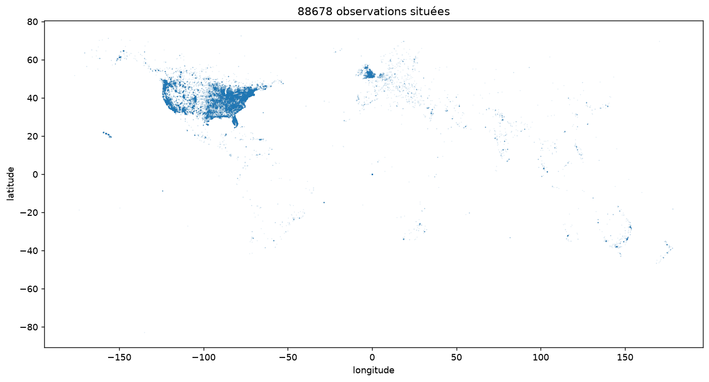

# Rapport au Conseil — réception des relevés Klaxo-3

## Phase 1 — Ouvrir la caisse

- Lignes dans le fichier : 88 875
- Lignes chargées : 88 679
- Lignes traitées à part : 196

Le fichier arrive sans en-têtes, je les remets depuis le manifeste. J'évite les options de
`read_csv` qui réparent les lignes cassées, parce qu'elles les suppriment sans prévenir : je
lis ligne par ligne et j'écarte tout ce qui n'a pas exactement 11 champs. J'ai aussi compté
les sauts de ligne du fichier brut, 88 875 aussi, donc rien n'a été fusionné en route.

Les 196 écartées ont toutes 12 champs. Le script en affiche une (ligne 877) : tout est
décalé d'un cran à partir du commentaire, et la longitude déborde en douzième position.
J'ai regardé si je pouvais les recoller, mais seulement 22 ont une reconstruction unique,
84 en ont deux possibles et 90 aucune. Ce serait inventer des valeurs, donc je les laisse
de côté — 0,22 % du fichier.

## Phase 2 — Rien n'est du bon type

Je convertis sans rien supprimer : ce qui ne passe pas devient `null` et je le compte.
88 679 lignes en entrée comme en sortie.

| Champ | Type visé | Vides | Ont résisté | Valeurs fautives |
|---|---|---|---|---|
| `duration_seconds` | nombre | 2 | 4 | 2, 8 et 0.5 suivis d'une apostrophe inversée, `2631600` entouré d'espaces |
| `latitude` | nombre | 0 | 1 | `33q.200088` |
| `longitude` | nombre | 0 | 0 | — |
| `datetime` | date + heure | 0 | 1220 | `9/1/2012 24:00` |
| `date_posted` | date | 0 | 0 | — |

Les six autres champs sont du texte et le restent.

| Anomalie | Compte | D'où ça vient |
|---|---|---|
| lettre au milieu d'une coordonnée | 1 | transmission |
| apostrophe inversée collée à la durée | 3 | témoin |
| espaces autour de la durée | 1 | transmission |
| heure `24:00`, qui n'existe pas | 1220 | capteur |
| entités HTML dans le témoignage (`&#44`) | 35 417 | transmission |
| pays non renseigné | 12 365 | témoin |
| coordonnées à (0, 0) | 1 494 | capteur |

Pour l'origine je regarde qui écrit quoi. Les coordonnées sont calculées et pas tapées, donc
une lettre au milieu vient du transport ; l'apostrophe collée à un chiffre, elle, est une
faute de frappe. Le `24:00` revient 1220 fois : c'est une convention du système qui
horodate, pas une erreur isolée. Les `&#44` sont un encodage ajouté pour que les virgules
des témoignages ne cassent pas le CSV.

Les deux dernières anomalies ne font planter aucune conversion, c'est ce qui les rend
gênantes. Les 1 494 coordonnées à (0, 0) sont des villes comme `turin (italy)` que le
géocodage n'a pas su placer : zéro est un nombre valide, donc rien ne proteste, mais le
point atterrit au large de l'Afrique.

Une seule valeur, `33q.200088`, suffirait à faire basculer toute la colonne `latitude` en
texte si on laissait la bibliothèque deviner les types. Une fois les types corrigés, la
carte que le Conseil demandait se trace sans rien changer d'autre :

On reconnaît les États-Unis, l'Europe, le Japon et l'Australie. Le point isolé au large de
l'Afrique, ce sont les 1 494 coordonnées à (0, 0).

## Phase 3 — Trier les canulars

**La règle :** un relevé est un canular si le Bureau a écrit dans sa note qu'il s'agit d'un
canular, ou d'un rapport d'élève qu'il ne peut pas certifier.

- Marqués canulars : **871** sur 88 679, soit **0,98 %** — 781 notés « hoax », 90 notés
  « student report » seulement

Le Bureau annote les dossiers douteux entre doubles parenthèses : `((HOAX??))` devant le
témoignage, ou `((NUFORC Note: Student report. PD))` à la fin. Je ne retiens que ce qui est
écrit dans ces notes. 21 autres relevés contiennent bien le mot « hoax », mais c'est le
témoin qui l'écrit, souvent pour jurer que son observation n'en est pas un.

J'ai regardé ce que le Bureau écrit d'autre. Il annote surtout des méprises — Vénus, Sirius,
une traînée d'avion, un lancement de missile — soit 1 478 relevés. Je ne les compte pas :
le témoin a bien vu quelque chose, il l'a mal identifié, ce n'est pas un mensonge.

Ce que la règle rate : tous les canulars que le Bureau n'a jamais annotés. Elle ne mesure
pas les canulars, elle mesure le travail d'annotation du Bureau. 0,98 % est donc un
plancher, sûrement très en dessous du vrai chiffre.

Ce qu'elle attrape à tort : 622 des 871 notes disent « hoax?? », avec deux points
d'interrogation. C'est un soupçon, pas un verdict, et je les compte quand même comme
canulars.

## Phase 4 — Le premier verdict

- Sur 100 canulars réellement présents, le système en attrape : `…`
- Sur 100 relevés signalés, sont vraiment des canulars : `…`
- Ces nombres sont calculés sur : *(quels relevés, jamais vus à l'entraînement)*

## Phase 5 — Le Conseil ne vous croit pas

| Colonne | Qui écrit l'information | À quel moment | Cette personne savait-elle déjà s'il s'agissait d'un canular ? |
|---|---|---|---|
|  |  |  |  |

Colonnes retirées du modèle :

|  | Avant | Après |
|---|---|---|
| Sur 100 canulars, attrapés |  |  |
| Sur 100 signalés, justes |  |  |

Pourquoi le premier chiffre n'avait pas le droit d'exister (trois lignes) :

## Phase 6 — Le modèle le plus bête du Bureau

- Taux de bonnes réponses du stagiaire (« jamais un canular ») : `…`
- Taux de bonnes réponses du vrai modèle : `…`

La mesure présentée au Conseil, et pourquoi (trois lignes) :

Pourquoi le score du stagiaire ne prouve rien :
